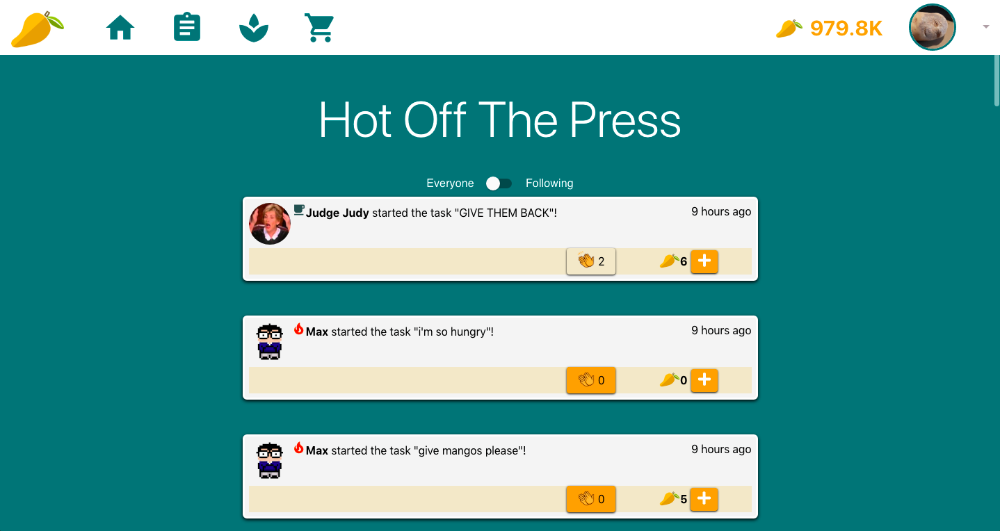

# DoGether

## Project Requirements 

### Project Description:
Do more together with DoGether!

DoGether is a social task management app that helps users motivate users.

Using DoGether, you can create Tasks, browse others' Tasks, and support each other by giving a currency of "Mangos"; Extra motivation comes in the form of achievements, and even a store to spend hard-earned Mangos.

https://dogetherapp.herokuapp.com/

**Backend**

[https://github.com/maxahn/MangoDBackend](https://github.com/maxahn/MangoDBackend)

Before you go to the boring text, here's some screenshots of the app!

### Project task requirements

**3-5 minimal requirements**

- ~To be able to add/complete tasks~ [Complete]
- ~Currency system (donating “bits” to tasks, so that the person gets these “bits” upon task completion)~ [Complete]
- ~Global “task feed” curated from other users~ [Complete]

**3-7 "standard" requirements**

- ~Edit and delete tasks~ [Complete]
- ~Subtasks and progress based on these~ [Complete]
- ~Login and signup system~ [Complete]
- ~User profile~ [Complete]
- ~Follow/Unfollow System - news feed with just the tasks of the people you're following (huge in scope, so keep note when creating normal feed, so it can be extended)~ [Complete]
- ~Have your tasks there after you sign in again~ [Complete]
- ~Store (to create incentivize obtaining of bits)~ [Complete]

**2-3 stretch requirements**

- ~Game~ [Complete]
- ~Behaviour based on task deadline having passed (Turn into a rotten mango colour)~ [Complete]
- In app notification (friends’ tasks, etc)
- ~Bahaviour for being able to edit names of tasks~ [Complete]
- Ads (watch ads to get bits? Room of ads where you afk and get bits)
- Email notification reminder to complete your tasks
- Create our own API
- Statistics (how many tasks you’ve done in a week/month, tracking your bit gain (get to do cool graph stuff))

### Usage of Unit 1-5 tech

**HTML, Javascript and CSS:**
For the majority of the code, HTML was not used, other than for the index.html holding our CDN references. We used Bootstrap to help with formatting our UI and simplifying our development process with existing React components. Media queries were also used to make a responsive app for any device and resolution.

**React & Redux:**
We used React as the main frontend language to create dynamic components which we laid out in a component based folder structure preferred in the industry. We used Redux to retain UI state and also local copies of backend data (user, task, feed data) to ensure faster load times while we used thunk to fetch data from the backend API. Finally, ESLint pre-commit hooks kept our codebase clean.

**MongoDB:**
We used MongoDB to save user information, as well as task information. After some comparison of Mongo Shell and Mongoose (via our assignments), we chose to use Mongo Shell. To help with testing, we created seed scripts to drop collections and repopulate them with dummy data.

**Node & Express:**
Our backend API was written in Express and held in a separate repo from our frontend. We used a proxy to interact with the backend, which interacted with the database using a Mongo Shell connection. Finally, Nodemon helped us iterate quicker and smoother.

**Release Engineering:**
We deployed our app by building our frontend statically and deploying the backend. By using the Heroku CLI and the dashboard we created a pipeline with automatic deployment.

### Above and Beyond Functionality

When we were brainstorming what kind of social media app we wanted to create, we knew we needed something different from the standard functionalities such as liking a post or retweeting something. Thus, the mango currency system was born! Now, when users are scrolling down the task feed and see a task they’d like to support, they can gift that task mangos. Mangos will be pooled in that task and when the owner of that task completes it, they will be awarded that task. It’ll provide extra incentive and motivation to complete tasks, not only to get the mangos, but to know that those are mangos given by people who thought your task was worthwhile. 

But what can users do with mangos? They can purchase badges that will be displayed next to their names on the task feed. Badges will hold a level of esteem since they will demonstrate immediately to other users how many mangos you’ve earned. 

Users can also earn mangos through on the simple idle game page where mangos slowly ripen on a tree and may be harvested. The game provides not only an alternate source for mangos, but an incentive for users to return to the app. A common problem for todo apps is that it’s easy to fall behind on tasks and become demotivated to even open app. By providing something that’s always positive for the users to return to, we can make opening Dogether more of a habit for users.

Additionally, another aspect where we wanted to take a step further was by delivering our static assets and user profile images via CDN to help reduce latency and increase the overall loading performance of our application.

### Description of Next Steps

We want to increase the social aspect of the app by adding the ability to be able to search for a user, get notification when your followers start a new task and to be able to comment on tasks. This will give encouragement to add tasks and attract users to check the app to see if they've received more comments. We also plan to add ads and give the user an option to watch a video ad and get mangos as a reward.

#### Upgrade options to mango idle game
- Can purchase mango tree slots
- Be able to upgrade trees to improve harvesting of mangos
- Incentivizes interaction with app, and improves retention (ex. User comes back to harvest mangos, uses task app)

#### Searching a user using username not using the url
- Be able to search for a user based on the username to be able to follow your friends
- Adds a secondary flow to access a user’s profile

#### Comment section for tasks
- Be able to comment on tasks seen on the feed to make it more interactive
- Be able to see comments in the profile and add comments

#### IAP for mangos
- Transfering claps to mangos
- Use credit card/paypal to get more mangos
- Integrate Stripe to simplify the online payment processing

#### Suggesting users you can follow based on similarity of tasks
- Use an ML NLP model that takes in a user’s tasks and assigns a similarity score to a user’s own tasks. If it meets a certain threshold, send a follow suggestion to the user

#### Notification/Reminder system
- Be able receive notifications on how many claps and mangos you’ve received as well as who gave them
- By allowing people to see who gave them claps and mangos, they can reciprocate

### List of Contributions

**Ryan Oh**
- User authentication via Auth0 while connecting them to our own user documents in MongoDB.
- Deployment via Heroku with research into best practices for a double repo project.
- Navbar and frontend routes via React-Router to navigate on a single page application and profile url to visit others’ profiles.

**Aamir Sheergar**
- Created a feed component that displays public or following tasks, social interaction components for the feed, and a mango store component to allow users to purchase badges that are displayed on the feed.
- Created backend routes for the feed, store, and various user data updates.
- Integrated AWS S3 media storage and AWS CloudFront CDN for static asset and user profile image delivery.

**Mohamed Abouzaid**
- Added the subtasks component to each task with the progress bar with their functionalities
- Implemented following and unfollowing users, and completed tasks feeds with their functionalities in a user profile
- Adjust styling for the profile page and subtasks on different screens

**Max Ahn**
- Implemented task related functionality, including the components, redux actions and reducer and back end routes
- Implemented task view to organize and filter tasks
- Implemented the mango idle game and related backend routes

## Prev README

**Who is it for?**

People who need extra external motivation to complete their tasks

**What will it do? (What "human activity" will it support?)**

* Be able to track tasks to complete
* Be able to see what tasks other people are working on
* Be able to give and receive support for working on tasks
* Earn currency by completing tasks and spend them to ‘cheer’ on others to complete tasks or spend in store

**What type of data will it store?**
* Tasks to complete (text)
* Avatars (images)
* Journaling (text, number rating)
* Point System/Claps (number)
* Metadata 

**What will users be able to do with this data?**

Look at it to help live their lives fruitfully

**What is some additional functionality you can add/remove based on time constraints?**
* In app currency
* Score system

### Final Mockups
https://www.figma.com/file/M9LqeYv0TbIlPJayqxzVcG/CPSC-436I-DoGether-Final-Mockup?node-id=0%3A1

### 2 of our minimal requirements broken down

**Design main UI for task creation**
* Saving and storing tasks on DB
* Progress (and subtask) tracking system
* Time
* Fetching bits and aggregating reward

**Task Feed**
* Global feed population from DB
* Design global feed UI (including claps, comments, and bits)
* Data design for claps and bits and saving these in each task

## Mockups:
**Site Sketch:**

http://msaubc.com/mangodb-login

**Task creation flow**

https://www.figma.com/file/aXDjOc7BS4OtwcogdVTfEL/CPSC-436---Prototype-Sketches?node-id=0%3A1

**Feed sketches**

**Task sketches**

